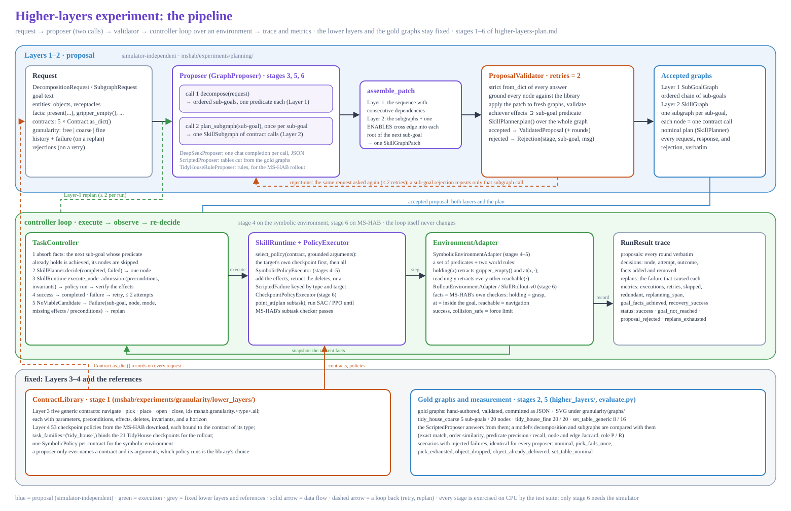
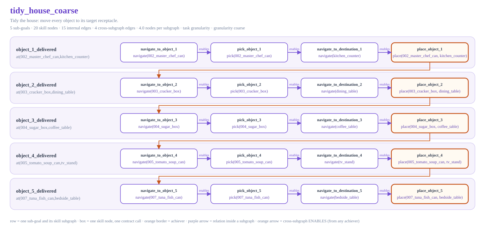
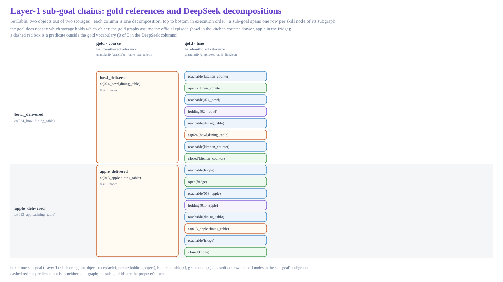
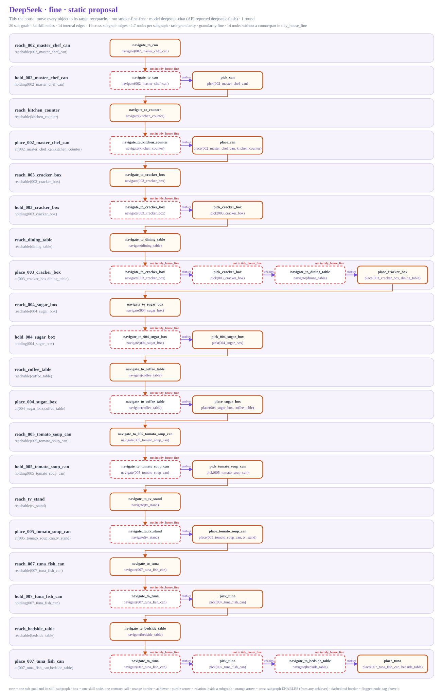
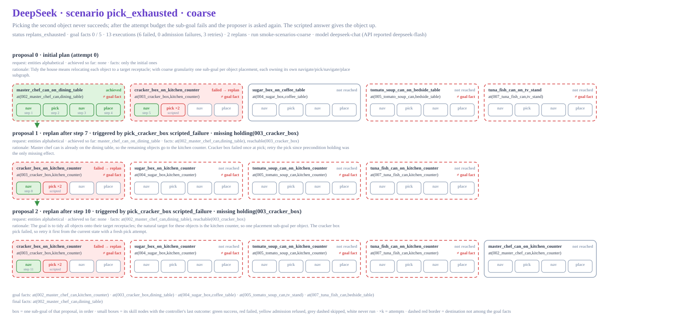

# Figures of the higher-layers experiment

Pictures of what [`higher-layers-plan.md`](../higher-layers-plan.md) describes:
the pipeline from the request to the trace, the hand-authored gold graphs the
model is measured against, and what DeepSeek actually proposed in the first
runs of 2026-09-20 (the sub-goal chains of Layer 1 and the skill-node graphs
of Layer 2, including the replans inside two scenario runs).

Every figure is deterministic SVG written by
`python -m mshab.experiments.docs.figures.render`. The DeepSeek figures are
drawn from the compact extracts in [`extracts/`](extracts/), not from the gitignored
run directories, so they regenerate on a clean clone;
`tests/granularity/test_experiment_figures.py` checks that they do.

## The pipeline



Blue band: the two proposer calls, the assembler, and the validator with its
retry rounds; the objects are those of [`../../planning/`](../../planning/README.md).
Green band: the controller loop, which is the same on the symbolic environment
(stages 4 and 5) and on MS-HAB (stage 6, [`../../rollout/`](../../rollout/README.md)).
Grey band: what stays fixed, the contract library of
[`../../granularity/`](../../granularity/README.md) and the gold graphs.

## The gold graphs

The two references of the granularity axis, rendered one row per sub-goal by
the granularity experiment itself (`python -m mshab.experiments.granularity.render`):

| Graph | Sub-goals | Nodes | Rendering |
| --- | --- | --- | --- |
| `tidy_house_coarse` | 5 | 20 | [`tidy_house_coarse.svg`](../../granularity/graphs/tidy_house_coarse.svg) |
| `tidy_house_fine` | 20 | 20 | [`tidy_house_fine.svg`](../../granularity/graphs/tidy_house_fine.svg) |
| `set_table_generic` | 8 | 16 | [`set_table_generic.svg`](../../granularity/graphs/set_table_generic.svg) |



The same renderer draws the DeepSeek graphs below, so a model's graph and its
reference read alike: orange border = the achiever of the row's sub-goal,
purple arrows = relations inside a subgraph, orange arrows = the
cross-subgraph `ENABLES` edges the assembler adds.

## Layer 1: the sub-goal chains side by side



One column per decomposition, top to bottom in execution order, aligned by
transfer: a coarse sub-goal spans the four fine sub-goals of the same object.
The two gold columns come first, then the three static DeepSeek proposals
(`coarse`, `free`, `fine`), then the initial proposal of each scenario run.
A dashed red box is a predicate that is not among the gold goal facts.

## Layer 2: the DeepSeek node graphs of the static proposals

A *static* proposal is the answer to the goal under the nominal facts, before
anything runs (`evaluate.py --no-scenarios`). Nodes with a dashed red border
have no counterpart in the gold subgraph of the same predicate.

| Figure | Granularity | Sub-goals | Nodes | Against the gold graph |
| --- | --- | --- | --- | --- |
| [`deepseek_coarse_static.svg`](deepseek_coarse_static.svg) | `coarse` | 5 | 20 | identical to `tidy_house_coarse` up to node ids |
| [`deepseek_free_static.svg`](deepseek_free_static.svg) | `free` | 5 | 20 | the model chose the coarse decomposition; identical to `tidy_house_coarse` up to node ids |
| [`deepseek_fine_static.svg`](deepseek_fine_static.svg) | `fine` | 20 | 34 | the 20 predicates are exactly `tidy_house_fine`'s, but 14 nodes are extra |



## Replans inside two scenario runs

One block per proposal of the run: the initial plan, then every Layer-1 replan
with the failure that triggered it, the model's rationale, and what the
controller did with each skill node (green success, red failed, yellow
admission refused). Both runs are `coarse`; both end with no goal fact
achieved.

| Figure | Scenario | Status | Replans | Executions |
| --- | --- | --- | --- | --- |
| [`deepseek_object_dropped_coarse_replans.svg`](deepseek_object_dropped_coarse_replans.svg) | a place drops the cracker box once | `goal_not_reached`, 0 / 5 | 1 | 25, 2 failed |
| [`deepseek_pick_exhausted_coarse_replans.svg`](deepseek_pick_exhausted_coarse_replans.svg) | picking the cracker box never succeeds | `replans_exhausted`, 0 / 5 | 2 | 13, 6 failed |



## What the figures show

- **The goal text does not pair objects with receptacles.** *"Tidy the house:
  move every object to its target receptacle."* names no pairing, and neither
  do the entities or the facts. In the static requests the receptacles happen
  to be listed in transfer order and the model pairs by position, which is
  why the static agreement with the gold chains is exact. The scenario runs
  take their entities from the environment snapshot, alphabetically, and the
  model guesses: its own rationale says *"no scene fact ties any object to a
  specific receptacle"*. Nine of the ten destinations in the two initial
  scenario proposals differ from the goal facts, every transfer is executed
  faithfully, and the runs end with all five objects on the wrong furniture.
  The stage-6 episode's goal text pairs every object with its receptacle for
  this reason.
- **Fine granularity makes the model re-navigate.** With one predicate per
  sub-goal, every `holding(x)` subgraph gets a `navigate(x)` before its pick
  and every `at(x, r)` subgraph a `navigate(r)` before its place, although the
  previous sub-goal just established that fact; two `at` sub-goals are whole
  `navigate -> pick -> navigate -> place` chains. The chain of predicates is
  exactly the gold one, the node graph is 34 nodes against 20.
- **The model does not give up a failing transfer.** In `pick_exhausted` both
  replans put the cracker box first again ("retry the pick"), the second one
  also lists the already delivered can, and the run exhausts its replans on
  the same node. The scripted proposer's answer to this scenario drops the
  object.
- **Recovery works when the plan is sound.** In `object_dropped` the retry of
  the place is refused at admission (`holding` missing), the replan navigates
  back, picks the box up again, and places it, and the remaining transfers
  run through: the recovery of the stage-4 scenario, with the wrong
  destinations.
- **Everything was accepted first try.** No proposal needed a retry round; the
  validator's rules were never hit by this model.

## Data and regeneration

| File | Source | Run |
| --- | --- | --- |
| `extracts/static_coarse.json` | `tidy_house/coarse/sample_00/static.json` | `deepseek-chat-20260920-214412` |
| `extracts/static_free.json`, `extracts/static_fine.json` | `tidy_house/{free,fine}/sample_00/static.json` | `smoke-fine-free` |
| `extracts/scenario_object_dropped_coarse.json`, `extracts/scenario_pick_exhausted_coarse.json` | `tidy_house/coarse/sample_00/scenario_*.json` | `smoke-scenarios-coarse` |

All three runs asked for `deepseek-chat`; the API reported `deepseek-flash`
as the serving model in every exchange. Every proposal was accepted in one
round. An extract keeps the accepted responses, the request's entities,
facts, history, and failure, the controller's decisions and replans, and the
evaluation numbers; it drops the contract inventory every request repeats.

```bash
# redraw every figure from extracts/
python -m mshab.experiments.docs.figures.render

# refresh extracts/ from evaluation runs first (a run directory holds summary.json,
# exchanges.json, and the traces), then redraw
python -m mshab.experiments.docs.figures.render --extract mshab_exps/planning/<run> ...
```

Extracts are named by granularity (`static_<granularity>.json`) and by
scenario (`scenario_<name>_<granularity>.json`), so a later run at the same
setting replaces the earlier extract. The figure files follow the same names.
