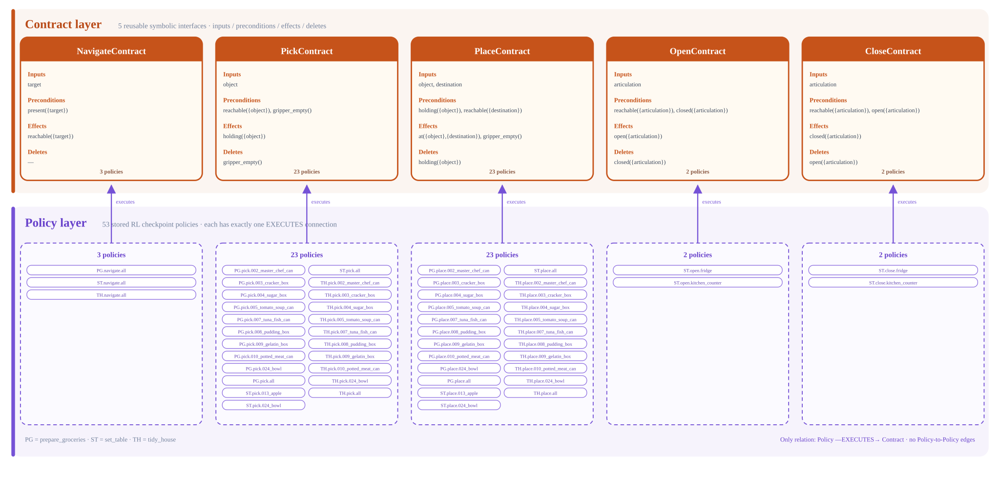

# Graph-granularity experiment: Layers 3 and 4

This package currently implements only the two lower layers shared by the
future coarse- and fine-grained graph experiments. Goal, Sub-goal, SkillNode,
and SkillSubgraph are intentionally not created yet.



## Code structure

The responsibilities are separated into three files:

```text
lower_layers/
├── layer3.py       five symbolic Contract objects
├── layer4.py       53 stored Policy objects
└── connections.py  Policy --EXECUTES--> Contract

higher_layers/      empty placeholder; no implementation yet
```

Layer 4 is storage only. It contains no fallback, alternative, routing,
selection, or Policy-to-Policy relationships. The only relationship involving
a Policy is the cross-layer `EXECUTES` connection defined in
`connections.py`.

## Layer 3: five parameterized contracts

`lower_layers/layer3.py` reuses the production OOP classes from
`mshab.skills.model`:

| Contract | Inputs | Preconditions | Effects | Deletes |
| --- | --- | --- | --- | --- |
| `NavigateContract` | `goal` | `present(goal)` | `reachable(goal)` | — |
| `PickContract` | `object` | `reachable(object)`, `gripper_empty()` | `holding(object)` | `gripper_empty()` |
| `PlaceContract` | `object`, `destination` | `holding(object)`, `reachable(destination)` | `at(object,destination)`, `gripper_empty()` | `holding(object)` |
| `OpenContract` | `articulation` | `reachable(articulation)`, `closed(articulation)` | `open(articulation)` | `closed(articulation)` |
| `CloseContract` | `articulation` | `reachable(articulation)`, `open(articulation)` | `closed(articulation)` | `open(articulation)` |

All five are generic schemas with target `all`. A future SkillNode will ground
one Contract with a concrete object, destination, or articulation.

## Layer 4: 53 stored policies

`lower_layers/layer4.py` stores the downloaded MS-HAB RL policies as real
`CheckpointPolicy` objects:

- 3 Navigate policies.
- 23 Pick policies.
- 23 Place policies.
- 2 Open policies.
- 2 Close policies.

The store records identity and checkpoint metadata only. It does not determine
which Policy should be selected after success or failure.

## EXECUTES connections

`lower_layers/connections.py` constructs one explicit connection per Policy:

```text
Policy --EXECUTES--> Contract
```

Examples:

```text
rl.set_table.pick.013_apple --EXECUTES--> mshab.granularity.pick.all
rl.set_table.pick.all       --EXECUTES--> mshab.granularity.pick.all
rl.tidy_house.navigate.all  --EXECUTES--> mshab.granularity.navigate.all
```

There are 53 Policies and therefore 53 `EXECUTES` connections. Every Policy
executes exactly one of the five Contracts. A Contract may be executed by many
Policies.

Fallback and alternative relations belong in a future SkillSubgraph in Layer
2. They are not represented in Layer 4 or in these cross-layer connections.

## Build and inspect

From the repository root:

```bash
MS_ASSET_DIR=../mshab-assets \
PYTHONPATH=. \
python -m mshab.experiments.granularity.render
```

This generates:

- `artifacts/layer3_layer4.json`: independent Layer-3 and Layer-4 records plus
  the 53 `EXECUTES` connections.
- `artifacts/contract_policy_layers.svg`: the diagram above.

The JSON excludes absolute checkpoint paths and local readiness state, making
it stable across machines.

## Python usage

Build the layers independently:

```python
from pathlib import Path

from mshab.experiments.granularity import build_layer3, build_layer4

layer3 = build_layer3()
layer4 = build_layer4(Path("../mshab-assets/data/mshab_checkpoints"))
```

Create their `EXECUTES` connections explicitly:

```python
from mshab.experiments.granularity import connect_layers

connected = connect_layers(layer3, layer4)
assert len(connected.connections) == 53
```

The next phase can build coarse and fine upper-layer graphs over the same
connected lower layers without changing either the Contracts or Policies.
