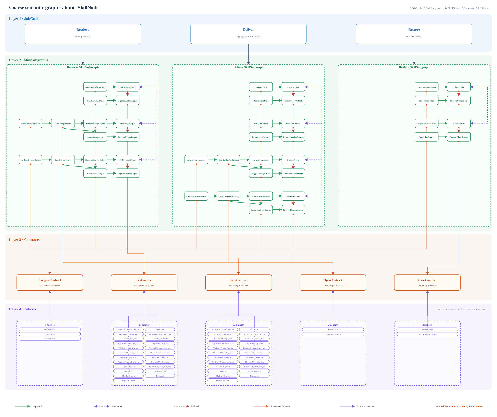
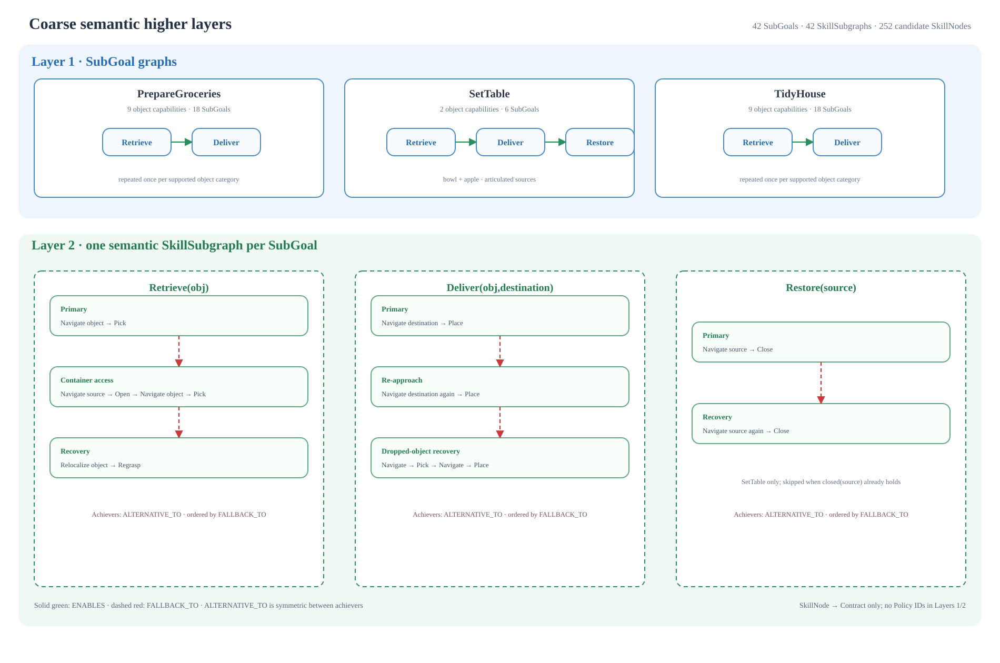

# Graph-granularity experiment

This package now contains the controlled lower layers and the first coarse
Layer-1/2 condition. The future fine-grained condition will reuse exactly the
same Contracts and Policies.






## Code structure

The domain builders remain separated; the four-layer entry point only composes
their existing objects and documents:

```text
coarse_four_layers.py  orchestration only; writes the unified JSON and SVG

lower_layers/
├── layer3.py       five symbolic Contract objects
├── layer4.py       53 stored Policy objects
└── connections.py  Policy --EXECUTES--> Contract

higher_layers/
├── coarse.py       task-agnostic three-SubGoal semantic OOP builder
├── render.py       deterministic JSON/SVG generator
└── artifacts/      canonical coarse catalog and overview diagram

artifacts/
├── coarse_four_layers.json
└── coarse_four_layers.svg

vlm/
├── config.example.yaml  local DeepSeek configuration template
├── prompt.py            constrained planner and judge prompts
├── run.py               compile, render, compare, and ground one model plan
├── simulator.py         lower graph routes to native MS-HAB PlanData
├── execute.py           invoke the existing evaluator on one grounded route
├── set_table_experiment.yaml  fixed 10-instruction/10-scene design
└── set_table_experiment.py    resumable 170-job experiment and tables
```

`coarse_four_layers.py` does not redeclare any SubGoal, SkillNode, Contract,
Policy, or relation inventory. It builds the existing lower stack once and
passes that same Layer-3 object to the existing higher-layer builder.

Layer 4 is storage only. It contains no fallback, alternative, routing,
selection, or Policy-to-Policy relationships. The only relationship involving
a Policy is the cross-layer `EXECUTES` connection defined in
`connections.py`.

## Layer 3: five parameterized contracts

`lower_layers/layer3.py` reuses the production OOP classes from
`mshab.skills.model`:

| Contract | Inputs | Preconditions | Effects | Deletes |
| --- | --- | --- | --- | --- |
| `NavigateContract` | `goal` | `present(goal)` | `reachable(goal)` | — |
| `PickContract` | `object` | `reachable(object)`, `gripper_empty()` | `holding(object)` | `gripper_empty()` |
| `PlaceContract` | `object`, `destination` | `holding(object)`, `reachable(destination)` | `at(object,destination)`, `gripper_empty()` | `holding(object)` |
| `OpenContract` | `articulation` | `reachable(articulation)`, `closed(articulation)` | `open(articulation)` | `closed(articulation)` |
| `CloseContract` | `articulation` | `reachable(articulation)`, `open(articulation)` | `closed(articulation)` | `open(articulation)` |

All five are generic schemas with target `all`. A future SkillNode will ground
one Contract with a concrete object, destination, or articulation.

## Layer 4: 53 stored policies

`lower_layers/layer4.py` stores the downloaded MS-HAB RL policies as real
`CheckpointPolicy` objects:

- 3 Navigate policies.
- 23 Pick policies.
- 23 Place policies.
- 2 Open policies.
- 2 Close policies.

The store records identity and checkpoint metadata only. It does not determine
which Policy should be selected after success or failure.

## EXECUTES connections

`lower_layers/connections.py` constructs one explicit connection per Policy:

```text
Policy --EXECUTES--> Contract
```

Examples:

```text
rl.set_table.pick.013_apple --EXECUTES--> mshab.granularity.pick.all
rl.set_table.pick.all       --EXECUTES--> mshab.granularity.pick.all
rl.tidy_house.navigate.all  --EXECUTES--> mshab.granularity.navigate.all
```

There are 53 Policies and therefore 53 `EXECUTES` connections. Every Policy
executes exactly one of the five Contracts. A Contract may be executed by many
Policies.

Fallback and alternative relations exist only in the coarse Layer-2
SkillSubgraphs. They are not represented in Layer 4 or in these cross-layer
connections.

## Build and inspect

From the repository root:

```bash
MS_ASSET_DIR=../mshab-assets \
PYTHONPATH=. \
python -m mshab.experiments.granularity.coarse_four_layers
```

This produces the complete graph:

- `artifacts/coarse_four_layers.json`: all four layers, 44
  SkillNode-to-Contract references, and 53 Policy-to-Contract `EXECUTES`
  connections.
- `artifacts/coarse_four_layers.svg`: one four-layer view with 3 SubGoals, 44
  SkillNodes, 5 Contracts, and 53 Policies.

To regenerate only the controlled lower layers:

```bash
MS_ASSET_DIR=../mshab-assets \
PYTHONPATH=. \
python -m mshab.experiments.granularity.render
```

This generates:

- `artifacts/layer3_layer4.json`: independent Layer-3 and Layer-4 records plus
  the 53 `EXECUTES` connections.
- `artifacts/contract_policy_layers.svg`: the diagram above.

The JSON excludes absolute checkpoint paths and local readiness state, making
it stable across machines.

## Python usage

Build the layers independently:

```python
from pathlib import Path

from mshab.experiments.granularity import build_layer3, build_layer4

layer3 = build_layer3()
layer4 = build_layer4(Path("../mshab-assets/data/mshab_checkpoints"))
```

Create their `EXECUTES` connections explicitly:

```python
from mshab.experiments.granularity import connect_layers

connected = connect_layers(layer3, layer4)
assert len(connected.connections) == 53
```

Build the coarse higher layers:

```python
from mshab.experiments.granularity.higher_layers import (
    build_coarse_higher_layers,
)

higher = build_coarse_higher_layers(layer3)
assert len(higher.subgoals.subgoals) == 3
assert len(higher.subgoals.dependencies) == 0
assert higher.skill_node_count == 44

# A VLM/oracle selects one semantic alternative before linear planning.
view = higher.execution_view("retrieve_from_fridge")
assert view.strategy.subgoal_id == "retrieve"
```

See [`higher_layers/README.md`](higher_layers/README.md) for the Layer-1/2
semantics, alternatives, fallbacks, n:1 Contract references, and VLM-ready
JSON artifact.

## DeepSeek graph planning

The [`vlm/`](vlm/) experiment gives DeepSeek the existing four-layer JSON and
an instruction, constrains it to select existing semantic strategies, and
compiles that selection locally into SkillNode → Contract → Policy steps.
It renders the resulting execution flow as JSON, DOT, and SVG.

MS-HAB supplies ordered, scene-grounded nominal `TaskPlan` JSON rather than a
fallback flowchart. The runner normalizes that plan into the same flow schema,
computes deterministic sequence and grounding metrics, and optionally uses a
separate DeepSeek call for a semantic comparison. See
[`vlm/README.md`](vlm/README.md) for configuration and commands.
