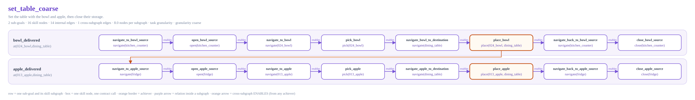

# Graph-granularity experiment

This package holds the two lower layers shared by the coarse- and
fine-grained graph experiments, as one `ContractLibrary` from
`mshab.skills`, and the hand-authored *gold graphs* built over them for the
official SetTable task. The plan that the package follows is
[`../docs/higher-layers-plan.md`](../docs/higher-layers-plan.md).


## Code structure

```text
lower_layers/
├── manifest.py    the 53 downloaded MS-HAB RL checkpoints as PolicySpec rows
└── library.py     build_granularity_library(): 5 generic contracts, 53 policies, 53 bindings

higher_layers/
├── builders.py    SetTableGraphBuilder(granularity), the segment ids and node roles
├── gold.py        registry, validation, JSON document, loader
├── scenarios.py   scenarios, storage physics, gold_proposer()/scenario_proposer(), run_scenario()
└── render.py      SVG rendering of the gold graphs

paths.py           default checkpoint, artifact, graph, and evaluation locations
svg.py             the text primitive both renderers share
render.py          python -m mshab.experiments.granularity.render: writes artifacts/ and graphs/
evaluate.py        python -m mshab.experiments.granularity.evaluate: the stage-5 sweep of a proposer
artifacts/         library.json and contract_policy_layers.svg
graphs/            committed gold graphs: <name>.json and <name>.svg
```

Everything else is the ordinary skill-library object model: `Contract` and
`CheckpointPolicy` from `mshab.skills.model`, bindings and policy selection
from `mshab.skills.library.ContractLibrary`. The package adds no storage or
relation classes of its own.

## Layer 3: five generic contracts

`library.py` registers one contract per `ContractType`, all with task
`granularity` and target `all`, so their ids are
`mshab.granularity.<type>.all`:

| Contract | Inputs | Preconditions | Effects | Deletes |
| --- | --- | --- | --- | --- |
| `NavigateContract` | `target` | `present(target)` | `reachable(target)` | — |
| `PickContract` | `object` | `reachable(object)`, `gripper_empty()` | `holding(object)` | `gripper_empty()` |
| `PlaceContract` | `object`, `destination` | `holding(object)`, `reachable(destination)` | `at(object,destination)`, `gripper_empty()` | `holding(object)` |
| `OpenContract` | `articulation` | `reachable(articulation)`, `closed(articulation)` | `open(articulation)` | `closed(articulation)` |
| `CloseContract` | `articulation` | `reachable(articulation)`, `open(articulation)` | `closed(articulation)` | `open(articulation)` |

A skill node grounds one of them with a concrete object, destination, or
articulation; the graphs that do so are the experiment's own test graphs, so
the ids keep the `granularity` task segment.

## Layer 4: the 53-policy manifest

`manifest.py` enumerates every `<family>/<task>/<type>/<target>` leaf of the
official RL download as a `PolicySpec` row and validates that the row names a
checkpoint that exists: navigation has only `all`, open and close exist only
for SetTable's `fridge` and `kitchen_counter`, and pick and place cover each
task's own object categories plus `all`.

- 3 Navigate policies.
- 23 Pick policies.
- 23 Place policies.
- 2 Open policies.
- 2 Close policies.

`PolicySpec.policy(checkpoint_root)` builds the `CheckpointPolicy`; its
`target` is the leaf's target segment. Readiness is read from the filesystem
at run time and never recorded.

## Bindings

Each policy is bound to the one contract of its type, in sorted policy-id
order:

```text
mshab.granularity.pick.all      <- rl.prepare_groceries.pick.002_master_chef_can, ..., rl.tidy_house.pick.all
mshab.granularity.navigate.all  <- rl.prepare_groceries.navigate.all, rl.set_table.navigate.all, rl.tidy_house.navigate.all
```

53 policies, 53 bindings. Binding order alone would let the apple checkpoint
execute a bowl pick, so which policy runs a grounding is decided with the
grounded arguments:

```python
library.select_policy("mshab.granularity.pick.all", arguments={"object": "024_bowl"})
# a ready checkpoint with target 024_bowl first, then one with target all;
# rl.set_table.pick.013_apple is never a candidate
```

`SkillRuntime` passes the grounded arguments through automatically. Fallback
and alternative relations belong to Layer 2; there are none in Layer 4 or in
the bindings. `build_granularity_library(root, task_families=("set_table",))`
binds only that task's checkpoints (11 policies: navigate `all`, pick and
place for `013_apple`, `024_bowl`, and `all`, open and close for `fridge` and
`kitchen_counter`); the MS-HAB rollout uses it, because with every family
bound the PrepareGroceries checkpoint of the same object sorts first.

## Gold graphs

A gold graph is a hand-authored, validated Layer-1/2 skill graph that exists
only for this experiment. It is the answer the scripted proposer returns and
the reference a real model's output is compared against; it is not a library
for later work to build on.

The task is the official SetTable episode: the bowl out of the kitchen
counter drawer and the apple out of the fridge, both onto the dining table,
each storage closed again afterwards. Per object the official plan is one
*segment* of eight atomic subtasks, `navigate -> open -> navigate -> pick ->
navigate -> place -> navigate -> close`; two segments, 16 subtasks. The goal
text names the results only and never says which storage holds which object:
*"Set the table with the bowl and apple, then close their storage."* A
proposer that opens the wrong storage finds out at the pick and has to plan
around it.

Every skill node is one contract call, which is one MS-HAB atomic subtask.
That is the only unit a policy can execute and the only unit the environment
verifies, so node granularity is fixed; what the experiment varies is how
many sub-goals own those nodes. With one generic contract per type there is
exactly one candidate node per role, so these graphs have no `FALLBACK_TO`
chains (the packaged SetTable graph keeps covering Layer-2 fallback).

| Graph | Sub-goals | Nodes | What it is |
| --- | --- | --- | --- |
| `set_table_coarse` | 2 | 16 | One `at(object,dining_table)` sub-goal per object; its subgraph is the whole segment: navigate -> open -> navigate -> pick -> navigate -> place -> navigate -> close |
| `set_table_fine` | 16 | 16 | `reachable(storage) -> open(storage) -> reachable(object) -> holding(object) -> reachable(dining_table) -> at -> reachable(storage) -> closed(storage)` per object; every subgraph is one node |

The two variants hold the same node ids, contracts, arguments, and nominal
execution order; only sub-goal ownership differs. In the coarse graph the
place node is the achiever of `at(object,dining_table)`, the nodes before it
prepare it, and the two nodes after it, navigating back and closing the
storage, are its *follow-ups*: work that belongs to the sub-goal but comes
once its predicate holds. `SkillPlanner` runs a sub-goal's follow-ups after
its achiever and before the next sub-goal, and the controller marks a
started sub-goal achieved only when nothing the planner wants is left, so
the predicate coming true at the place does not skip the closing.



`SetTableGraphBuilder(granularity)` takes `context={"segments": ((label,
object, storage), ...), "destination": ..., "steps": {label: (...)}}`. The
steps are the subset of `open`, `pick`, `place`, `close` a segment still
needs, which is how a replan says that a storage already stands open or an
object is already held; a segment with only `close` left becomes the
sub-goal `closed(storage)` (`<label>_storage_closed`). Sub-goal ids are
`<label>_delivered` (coarse) and `<label>_<kind>` for the eight fine kinds;
`segment_subgoal(id, labels)` parses them back.

Each committed `graphs/<name>.json` carries the `SkillGraphPatch` that builds
the graph, plus metadata, a structural summary, and the nominal plan.
`load_gold_graph(path, library)` rebuilds both layers from the patch alone,
revalidates them, grounds every node, plans, and rejects a document whose
summary or plan is stale.

```python
from pathlib import Path

from mshab.experiments.granularity import build_gold_graph, build_granularity_library, load_gold_graph
from mshab.experiments.granularity.higher_layers import gold_graph_path

library = build_granularity_library(Path("../mshab-assets/data/mshab_checkpoints"))
gold = build_gold_graph("set_table_fine", library)
gold.plan.order                       # 16 node ids
subgoals, graph = load_gold_graph(gold_graph_path("set_table_coarse"), library)
```

## Scenarios

`higher_layers/scenarios.py` fixes what a run cannot choose: the goal, the
initial facts, the success criterion (`goal_facts`), and what goes wrong
(`ScriptedFailure`s keyed by contract type and grounded target). A scenario is
independent of the proposer and of the granularity; only the scripted
proposer needs the replan answers it carries, a real model plans them itself.

Where the objects are is not a fact the proposer sees. Every scenario keeps
it as *storage physics*: a `ScriptedFailure` with `unless=("open(storage)",)`
makes the pick of an object time out, as it would on the simulator, while
the storage it is really in stands closed. The gold graphs assume the
official episode; `object_elsewhere` has the objects the other way round.

`run_scenario(SCENARIOS[name], granularity, library)` runs one on the
symbolic environment through the controller in
[`../planning/`](../planning/README.md) and returns the trace. Without an
explicit proposer it uses `scenario_proposer()`: the gold graphs' answers
plus the scenario's replan answers at that granularity. A `ScriptedReplan`
is a builder context (which segments are left and with which steps), built
by the gold builder and validated when the proposer is assembled; the
`ScenarioProposer` installs a replan's subgraphs when its decomposition is
served, so a sub-goal kept across a replan can get the subgraph the new
facts call for (no second `open` of a drawer that already stands open).

| Scenario | What happens | Coarse | Fine |
| --- | --- | --- | --- |
| `nominal` | every node succeeds | 16 executions | 16 executions |
| `pick_fails_once` | the bowl's pick fails once, the controller retries | 17 executions, 1 retry | same |
| `pick_exhausted` | the bowl's pick never succeeds; the sub-goal fails, the proposer gives the bowl up, closes its drawer, and does the apple | 15 executions, 1 replan spanning 2 sub-goals | 15 executions, 1 replan spanning 9 sub-goals |
| `object_dropped` | the bowl's place drops it; the retry cannot be admitted, the proposer plans the bowl again without re-opening the drawer | 21 executions, span 2 | 21 executions, span 11 |
| `object_already_delivered` | the bowl is on the table from the start, its drawer closed | its 8 nodes are skipped, 8 executions | nothing is skipped: 16 executions; the drawer is opened, the bowl picked up and put back, the drawer closed |
| `storage_already_open` | the fridge stands open from the start | the apple's `open` cannot be admitted twice, the sub-goal fails, 1 replan spanning 1 sub-goal; 17 executions | `open(fridge)` is absorbed, 1 node skipped, 15 executions, no replan |
| `object_elsewhere` | the bowl is in the fridge and the apple in the drawer; two picks behind the closed fridge time out | 1 replan spanning 2 sub-goals: the bowl through the fridge, the apple out of the drawer that already stands open; 19 executions | same failures, 1 replan spanning 12 sub-goals; 19 executions |

The `object_already_delivered` and `storage_already_open` rows are the
granularity effect in miniature. A coarse sub-goal `at(object,destination)`
is judged done as a whole, and a node inside it that cannot be admitted fails
the whole sub-goal; the fine sub-goals judge one predicate at a time, so a
state that already holds is absorbed, and a state that needs no work is
pursued anyway.

## Evaluation

`evaluate.py` is the stage-5 sweep: a proposer, per granularity (`free`,
`coarse`, `fine`), over several samples. Each sample first asks the proposer
for a plan under the goal's nominal facts through a `ProposalValidator` with
the model's retry budget, then runs every scenario through the controller
with the same proposer.

| Measurement | Where it comes from |
| --- | --- |
| validity: `accepted_first_try`, `accepted_after_retries`, `rejected`; rounds and proposer calls | the validator's rounds |
| decomposition: sub-goal count, predicate vocabulary, agreement with the gold sequence (`exact`, order similarity, precision, recall over predicates) | the accepted decomposition against `set_table_coarse` / `set_table_fine`; `free` is compared with both |
| subgraphs: node and edge agreement with the gold subgraph of the same predicate (nodes matched by contract type and arguments, since node ids are the proposer's own), plus the whole graph's role precision and recall | the accepted skill graph |
| scenarios: success rate, statuses, every run metric averaged (`replanning_span`, `proposal_retries`, ...) | `run_scenario` with the same injected failures |
| most frequent rejections, by stage and by rule (identifiers and lists blanked) | every round of every proposal, static or inside a run |

`achieved_subgoals` in a run's metrics counts distinct achieved predicates:
the fine graph reaches each storage and the table twice, so a nominal fine
run reports 13 for its 16 sub-goals.

```bash
# the real model; DEEPSEEK_API_KEY comes from the host or a .env file next to docker-compose.yml
docker compose run --rm mshab python -m mshab.experiments.granularity.evaluate --samples 3
# one granularity, static proposals only
docker compose run --rm mshab python -m mshab.experiments.granularity.evaluate \
    --granularities free --samples 5 --no-scenarios
# offline dry run of the whole pipeline with the gold graphs as the proposer
python -m mshab.experiments.granularity.evaluate --proposer scripted
```

Options: `--model` (`deepseek-chat`), `--base-url`, `--temperature` (server
default when omitted), `--max-tokens`, `--no-json-mode`, `--retries` (2),
`--goals` (`set_table`), `--granularities`, `--samples`, `--scenarios`,
`--no-scenarios`, `--no-static`, `--output`. Traces go to
`$MSHAB_EXPS_DIR/planning/<model>-<timestamp>/` (`mshab_exps/` on the host,
gitignored): one `static.json` and one `scenario_<name>.json` per sample,
`exchanges.json` with every model call, and `summary.json` with the
aggregates the console table shows. The scripted proposer only answers
granularities a gold graph was authored at, so the dry run skips `free`.

## Build and inspect

From the repository root:

```bash
MS_ASSET_DIR=../mshab-assets \
PYTHONPATH=. \
python -m mshab.experiments.granularity.render
```

This generates:

- `artifacts/library.json`: the five contracts with their policies in
  preference order, the 53 manifest rows with their contract, and a summary.
- `artifacts/contract_policy_layers.svg`: the diagram above.
- `graphs/<name>.json` and `graphs/<name>.svg` for every gold graph.

All of them exclude absolute checkpoint paths and local readiness state,
making them stable across machines. The figures under
[`../docs/figures/`](../docs/figures/README.md) draw a proposer's accepted
graphs with the same renderer, next to these gold graphs.

## Python usage

```python
from pathlib import Path

from mshab.experiments.granularity import build_granularity_library, contract_id

library = build_granularity_library(Path("../mshab-assets/data/mshab_checkpoints"))

pick = library.get(contract_id("pick"))
grounded = pick.bind({"object": "024_bowl"})
library.applicable_policies(pick.id, grounded.arguments)   # bowl checkpoints, then all
library.select_policy(pick.id, arguments=grounded.arguments)  # first ready of those
```

The proposer boundary whose scripted implementation answers with these gold
graphs lives in [`../planning/`](../planning/README.md); the rollout of a
proposer's plan on MS-HAB, over these contracts and one official SetTable
episode, in [`../rollout/`](../rollout/README.md).
