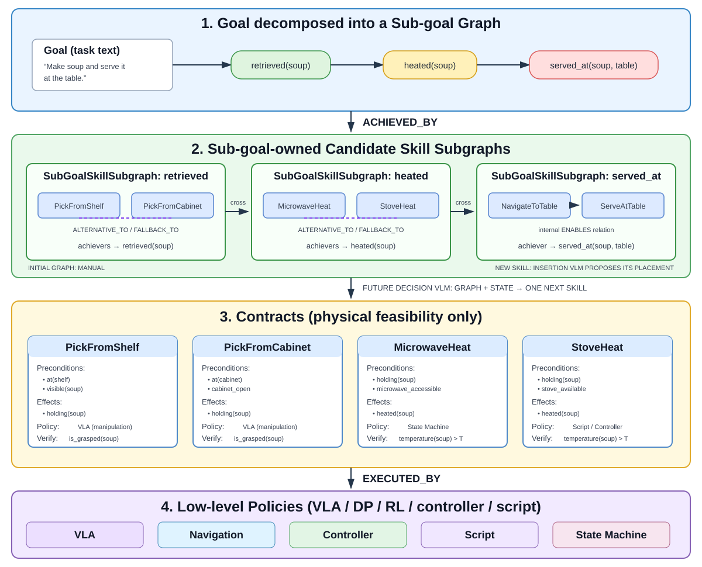

# MS-HAB Skill Library

This package is an object-oriented, four-layer skill library for
ManiSkill-HAB. Its most important boundary is:

- Layer 1 and Layer 2 are simulator-independent: symbolic sub-goals and skill
  nodes that know nothing about which simulator will execute them.
- Layer 3 and Layer 4 are simulator-specific libraries: the contract
  inventory, the policies bound to it, and the environment adapter are
  maintained per simulator. Today there is exactly one such library, for
  ManiSkill-HAB.

All four layers can be created, reviewed, and serialized before a simulator is
started. Only fact extraction, contract admission, and policy execution need a
live environment, and they reach it through the explicit environment adapter.

  

## Vocabulary

The words below are used with exactly one meaning throughout this package.

| Term | Meaning | Object |
| --- | --- | --- |
| goal | The text task description, for example *"Set the table"* | `SubGoalGraph.goal` (a string) |
| sub-goal | One symbolic milestone the goal is decomposed into, for example `holding(024_bowl)` | `SubGoal` |
| skill / skill node | One node of the skill graph. It names a contract and symbolic arguments. **"Skill" never refers to a contract or a policy.** | `SkillNode` |
| skill subgraph | The nodes and edges that implement one sub-goal. Not necessarily sequential. | `SkillSubgraph` |
| contract | What a skill node asks for: typed parameters, preconditions, effects, invariants, verification, all held directly as attributes. One node references exactly one contract; one contract may be referenced by many nodes. | `Contract` |
| policy | A low-level executable model or controller (RL, BC, DP, VLA, script), bound to contracts in `ContractLibrary` | `Policy`, `CheckpointPolicy` |
| grounded skill | A skill node bound to its contract with concrete arguments, so its predicates can be checked against live facts. | `GroundedSkill` |

## Guide

The detail lives in [`docs/`](./docs); this page is the entry point.

| Document | Contents |
| --- | --- |
| [Four-layer architecture](./docs/architecture.md) | Layer ownership, dependency direction, and the single source of truth for composition |
| [Layers 1 and 2](./docs/layers-1-2.md) | Sub-goal graph, skill subgraphs, edge semantics, one-node decisions, and two-level failure handling |
| [Extending Layers 1 and 2](./docs/extending.md) | `SkillGraphPatch`, sealed-subgraph extension, the catalog format, and the insertion VLM's boundary |
| [Layers 3 and 4](./docs/layers-3-4.md) | Contracts and facts, the environment adapter, policies and their bindings, and `YourContract` |
| [Data pipeline](./docs/data-pipeline.md) | How a SetTable run is actually produced: which object holds the data at each step, and what is dropped at every boundary |
| [Packaged SetTable graph](./docs/set-table.md) | The complete manual graph, running it in MS-HAB with video, and the apple starter stack |
| [Persistence](./docs/persistence.md) | What each layer can serialize, which artifacts are committed, and what a run leaves behind |
| [Installation, checkpoints, and tests](./docs/running.md) | Where Docker setup lives, checkpoint downloads, and the CPU-only test suite |

## Source layout

Paths are relative to this directory, except the `scripts/` and `tests/` rows
at the end of the table, which are relative to the repository root.

| File | Responsibility |
| --- | --- |
| `graph.py` | Simulator-independent Layer 1 and Layer 2 graph objects |
| `catalog.py` | Validated, machine-independent four-layer catalog format. **SetTable only** -- see "Where a task's code lives" below |
| `extension.py` | Validated `SkillGraphPatch` / `SkillGraphBuilder` interface |
| `plan.py` | `SkillPlanner`/`SkillPlan`: choose one achiever per sub-goal |
| `schema.py` | Strict `from_dict` primitives for untrusted documents |
| `tasks/set_table/` | Packaged SetTable graph, contract manifest, and stack builders |
| `tasks/tidy_house/` | Design note only, no code: the coarse/fine variants the granularity experiment implements elsewhere |
| `starter.py` | Backward-compatible SetTable imports |
| `model.py` | Layer 3 contract and Layer 4 policy definitions |
| `environment.py` | Environment description, entity mapping, snapshots, and adapter |
| `runtime.py` | Node grounding, contract monitoring, and policy dispatch |
| `your_contract.py` | Copyable `YourContract` extension template |
| `library.py` | `ContractLibrary`: contracts, policies, their many-to-many bindings, checkpoint discovery, and JSON export |
| `docs/` | The topic guides linked above |
| `scripts/generate_set_table_skill_graph.py` | Rebuild SetTable JSON and SVG artifacts |
| `scripts/build_set_table_graph_plan.py` | Ground a catalog-selected sequence with official scene data |
| `scripts/evaluate_set_table_graph_plan.sh` | Execute that sequence and record an MS-HAB video |
| `tests/skills/test_skill_library.py` | Unit tests for all four boundaries |
| `tests/skills/test_skill_graph_semantics.py` | Fallback, sealing, atomicity, schema |
| `tests/skills/test_contract_state_transitions.py` | Symbolic state transitions |
| `tests/skills/test_set_table_graph_decisions.py` | Manual graph -> repeated one-node decision test |
| `tests/skills/test_skill_library_checkpoints.py` | CPU-only downloaded-checkpoint integration tests |
| `tests/granularity/test_granularity_library.py` | The granularity experiment's `ContractLibrary` under `mshab/experiments/`, including target-aware policy selection |
| `tests/granularity/test_higher_layer_graphs.py` | The experiment's gold graphs: validity, grounding, coarse/fine equivalence, SetTable regression, committed artifacts |
| `tests/planning/test_planning_boundary.py` | The proposer boundary under `mshab/experiments/planning/`: documents, scripted proposer, assembler, validator rejections |
| `tests/planning/test_task_controller.py` | The symbolic environment and the `execute -> observe -> re-decide` controller on the experiment's scenarios at both granularities |
| `tests/planning/test_deepseek_proposer.py` | The real model behind the boundary with a fake transport: prompts, lenient-then-strict parsing, the validator's retry rounds and the further user turn |
| `tests/granularity/test_granularity_evaluation.py` | The stage-5 evaluation: agreement metrics against the gold graphs, rejection tally, the scripted dry run of the sweep |
| `tests/rollout/test_rollout.py` | Stage 6 on CPU: one official TidyHouse plan as the symbolic scene, facts from the environment's measurements, node -> plan subtask, the rule-based proposer, the runner's dry run |
| `tests/skills/test_task_packages.py` | Public and compatibility imports of the packaged SetTable graph |

### Where a task's code lives

Task-specific code reuses the OOP model in this directory instead of adding
task logic to `ContractLibrary`, but it lives in one of two places, and they
do not share a format:

| | `mshab/skills/tasks/` | `mshab/experiments/` |
| --- | --- | --- |
| Contains | Hand-authored reference implementations | Controlled experiments |
| Contract ids | One per object, `mshab.set_table.pick.013_apple` | Five generic, `mshab.granularity.pick.all` |
| Serialized as | `LibraryCatalog` (`catalog.py`) | Gold-graph documents (`SkillGraphPatch` JSON) |
| Today | SetTable, the packaged reference example | TidyHouse coarse/fine, SetTable regression; the MS-HAB rollout under `experiments/rollout/` |

The two serialization formats stay separate on purpose: `LibraryCatalog` is
the SetTable test artifact, and later work builds on the experiment's
documents instead. Nothing reads both. That decision, the contract-id
namespace, and why a skill node is exactly one MS-HAB atomic subtask are
recorded under "Decisions taken" in the
[higher-layers plan](../experiments/docs/higher-layers-plan.md).

So TidyHouse appears twice and neither copy is stale:
[`tasks/tidy_house/README.md`](./tasks/tidy_house/README.md) states the
controlled coarse/fine design, and
[`mshab/experiments/granularity/`](../experiments/granularity/README.md)
implements it. There is no `tasks/tidy_house/` Python module and none is
planned.

## Current implementation boundary

Implemented now:

- simulator-independent sub-goal and skill graphs;
- complete SetTable and smaller apple graphs covering all four layers;
- a declarative patch boundary for manual construction and future skill-node placement;
- extensible custom contract types;
- checkpoint discovery, many-to-many contract/policy bindings, and policy selection;
- environment entity/fact/snapshot adapter interface;
- contract grounding, admission, invariant monitoring, and verification;
- policy executor interface and auditable execution results;
- the online `execute -> observe -> re-decide` loop on a symbolic environment
  (`TaskController` in `mshab/experiments/planning/`): per-node retries,
  Layer-2 fallback through `SkillPlanner.decide()`, and the Layer-1 replan
  through a proposer;
- a real model behind the `GraphProposer` boundary (`DeepSeekProposer`, text
  only): `decompose()` feeds `SubGoalGraph.from_sequence`, `plan_subgraph()`
  returns one `SkillSubgraph`, the validator sends rejections back for a
  bounded number of retries, and `mshab.experiments.granularity.evaluate`
  measures validity, agreement with the gold graphs, and controller outcome
  per granularity;
- the same controller loop on MS-HAB (`mshab/experiments/rollout/`): a
  TidyHouse entity/fact extractor behind `MSHabEnvironmentAdapter`, a
  `PolicyExecutor` that loads the SAC/PPO checkpoints, an environment whose
  subtask pointer the runtime controls (`SkillRollout-v0`), and a GPU runner
  that rolls a proposer's plan out on one official episode with video.

Simulator-specific follow-up work:

- production vectorized SetTable entity/fact extractors (the TidyHouse ones
  in the rollout package drive one environment);
- BC/DP checkpoint loading and action adapters (the executor loads the RL
  checkpoints);
- measured policy performance and automatic policy routing;
- production insertion-VLM proposal parsing and validation;
- a trained decision model replacing the rule-based `SkillPlanner` is optional later work;
- a vision-capable proposer: the request documents reserve an `images` field that the text-only DeepSeek proposer refuses;
- insertion and decision quality evaluation.
