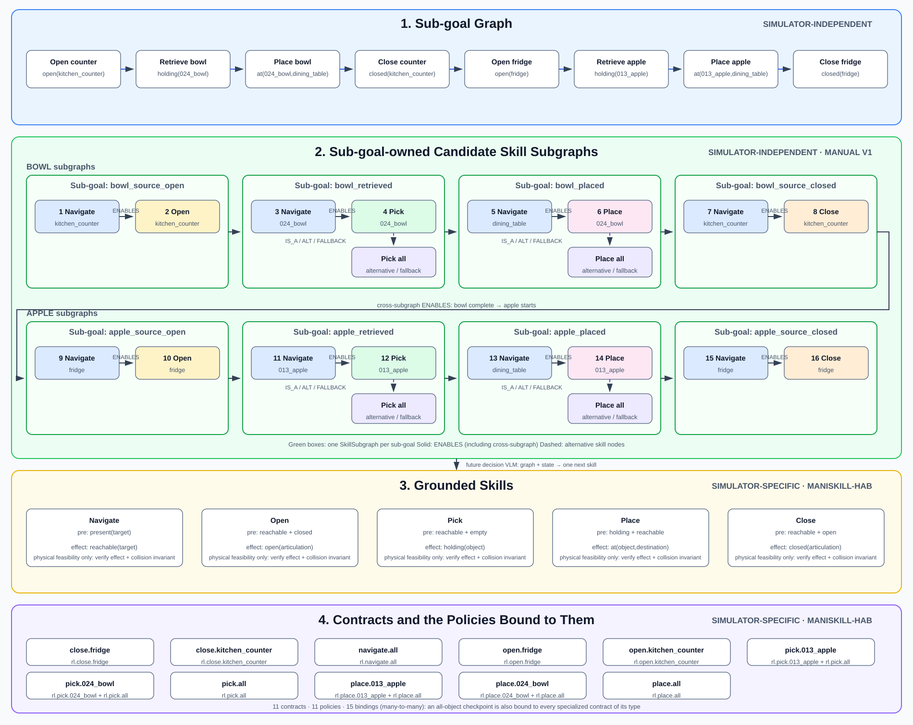

# MS-HAB Skill Library

This package is an object-oriented, four-layer skill library for
ManiSkill-HAB. Its most important boundary is:

- Layer 1 and Layer 2 are scene-independent. They can be created, reviewed,
  serialized, and extended before a simulator is started.
- Layer 3 and Layer 4 are environment-specific. They obtain entities,
  predicates, observations, success evidence, and actions through an explicit
  environment adapter.

<p align="center">
  
</p>

## Vocabulary

The words below are used with exactly one meaning throughout this package.

| Term | Meaning | Object |
| --- | --- | --- |
| goal | The text task description, for example *"Set the table"* | `SubGoalGraph.goal` (a string) |
| sub-goal | One symbolic milestone the goal is decomposed into, for example `holding(024_bowl)` | `SubGoal` |
| skill / skill node | One node of the skill graph. It names a contract and symbolic arguments. **"Skill" never refers to a contract or a policy.** | `SkillNode` |
| skill subgraph | The nodes and edges that implement one sub-goal. Not necessarily sequential. | `SkillSubgraph` |
| contract | What a skill node asks for: typed parameters, preconditions, effects, invariants, verification, all held directly as attributes. One node references exactly one contract; one contract may be referenced by many nodes. | `Contract` |
| policy | A low-level executable model or controller (RL, BC, DP, VLA, script) that executes a contract. | `Policy`, `CheckpointPolicy` |
| grounded skill | A skill node bound to its contract with concrete arguments, so its predicates can be checked against live facts. | `GroundedSkill` |

Two different questions are answered at two different layers:

- **Is this order sensible?** Edges between skill nodes (`ENABLES`, `REQUIRES`,
  `FALLBACK_TO`, ...) encode semantic or logical plausibility, for example that
  food is heated before it is served. They know nothing about the live scene.
- **Can this contract physically start right now?** Contract preconditions and
  invariants are checked against the current facts of one environment
  snapshot. They say nothing about whether running the contract at this point
  in the task is natural; that is the graph's job.

## Four-layer boundary

| Layer | Main objects | Scene-dependent? | Responsibility |
| --- | --- | --- | --- |
| 1. Sub-goals | `SubGoalGraph`, `SubGoal` | No | Decompose the goal into ordered symbolic sub-goal predicates |
| 2. Skill graph | `SkillGraph`, `SkillSubgraph`, `SkillNode` | No | Give every sub-goal its own skill subgraph and connect those subgraphs |
| 3. Contracts | `Contract`, `GroundedSkill`, `SkillGrounder`, `SkillRuntime` | Yes | Bind a node's arguments to its contract and check its predicates against live facts |
| 4. Policies | `Policy`, `CheckpointPolicy`, `PolicyExecutor` | Yes | Load a low-level policy or controller and interact with the environment |

The dependency direction is one-way:

```text
goal (task text)
    │
    ▼
Layer 1: SubGoalGraph                           scene-independent
    │ one sub-goal -> one skill subgraph
    ▼
Layer 2: SkillGraph / SkillSubgraph              scene-independent
    │ owns SkillNode + internal SkillEdge
    │ CrossSubgraphEdge connects sub-goal subgraphs
    │ edges = semantic / logical order
    ▼
Layer 3: GroundedSkill                          environment-specific
    │ node -> one contract; preconditions checked against current facts
    ▼
EnvironmentAdapter ◄────► Layer 4 PolicyExecutor
                         RL / BC / DP / VLA / controller / script policies
```

Layer 2 never stores a checkpoint, simulator actor, raw observation, or
policy choice. A `SkillNode` contains only:

```text
id + contract_id + symbolic arguments + achieved sub-goal ids
```

The OOP ownership hierarchy is:

```text
SubGoalGraph
└── SubGoal (Layer 1 definition)

SkillGraph (Layer 2 aggregate root)
├── SkillSubgraph[subgoal_id] (exactly one per implemented sub-goal)
│   ├── SkillNode (instrumental or sub-goal-achieving candidate)
│   └── SkillEdge (relations inside this sub-goal implementation)
└── CrossSubgraphEdge (relations between two sub-goal subgraphs)
```

Composition has exactly one source of truth: graph relations. There is no
`SequentialSkill` or `AlternativeSkill` class. Sequence, requirements,
alternatives, and fallback are values of `SkillRelation`; their ownership
determines whether they are stored inside a subgraph or between subgraphs.

## Source layout

| File | Responsibility |
| --- | --- |
| `graph.py` | Scene-independent Layer 1 and Layer 2 graph objects |
| `catalog.py` | Validated, machine-independent four-layer catalog format |
| `extension.py` | Validated `SkillGraphPatch` / `SkillGraphBuilder` interface |
| `plan.py` | `SkillPlanner`/`SkillPlan`: choose one achiever per sub-goal |
| `schema.py` | Strict `from_dict` primitives for untrusted documents |
| `starter.py` | Complete SetTable graph and smaller apple starter graph |
| `model.py` | Layer 3 contract and Layer 4 policy definitions |
| `environment.py` | Environment description, entity mapping, snapshots, and adapter |
| `runtime.py` | Node grounding, contract monitoring, and policy dispatch |
| `your_contract.py` | Copyable `YourContract` extension template |
| `library.py` | Registration, checkpoint discovery, querying, and JSON export |
| `scripts/generate_set_table_skill_graph.py` | Rebuild SetTable JSON and SVG artifacts |
| `scripts/build_set_table_graph_plan.py` | Ground a catalog-selected sequence with official scene data |
| `scripts/evaluate_set_table_graph_plan.sh` | Execute that sequence and record an MS-HAB video |
| `tests/test_skill_library.py` | Unit tests for all four boundaries |
| `tests/test_skill_graph_semantics.py` | Fallback, sealing, atomicity, schema |
| `tests/test_contract_state_transitions.py` | Symbolic state transitions |
| `tests/test_set_table_graph_decisions.py` | Manual graph -> repeated one-node decision test |
| `tests/test_skill_library_checkpoints.py` | CPU-only downloaded-checkpoint integration tests |

## Complete generated SetTable graph

The first complete manual SetTable graph follows the official 16-step task
order: bowl from `kitchen_counter`, then apple from `fridge`. It includes 8
sub-goals, **8 sub-goal-owned skill subgraphs**, 20 candidate skill nodes, 24
internal edges, 7 cross-subgraph edges, 20 grounded skills, and all 11
canonical contract records. The cross-subgraph edges
leave their source endpoint open (any achiever of that sub-goal), so the
flattened `graph.edges` view expands them into 11 concrete edges, for 35 in
total.

The generated machine-readable graph is
[`catalogs/set_table.json`](./catalogs/set_table.json).

<p align="center">
  
</p>

Rebuild both artifacts. This works on a clean clone: checkpoint availability
is runtime inventory state and is deliberately excluded from the canonical
catalog.

```bash
# Layers 1-2 are stdlib-only: any local Python 3.9+, or inside the container.
python scripts/generate_set_table_skill_graph.py
```

Build it directly in Python:

```python
from pathlib import Path

from mshab.skills import build_set_table_stack

set_table = build_set_table_stack(
    Path("/root/.maniskill/data/mshab_checkpoints")
)
```

### Execute a graph-selected SetTable sequence and record video

`SkillPlanner` chooses the skill-node sequence from the catalog. The bridge
script then copies only scene-specific grounding (object instance ids,
articulations, poses, and build/init configs) from one official MS-HAB
`PlanData`; it does not use the official sequence as the planner.

Every command below runs in the container. `docker compose run` starts in
`/work/mshab` (the bind-mounted repository) with `MS_ASSET_DIR`,
`MSHAB_EXPS_DIR` and the checkpoint mount already set, so nothing needs to be
exported first. See [Installation](#installation).

Inspect the 16 graph decisions without loading CUDA or starting the simulator:

```bash
docker compose run --rm -e DRY_RUN=True mshab \
  ./scripts/evaluate_set_table_graph_plan.sh nominal
```

Run that graph-selected plan with the downloaded per-object policies and save
one annotated video:

```bash
docker compose run --rm mshab \
  ./scripts/evaluate_set_table_graph_plan.sh nominal
```

Videos and tensorboard logs go to `MSHAB_EXPS_DIR`, which `docker-compose.yml`
points inside the bind-mounted repository, so on the host they appear under:

```text
./mshab_exps/set_table-graph-plan/nominal_plan0_seed0/eval_videos/*.mp4
```

`mshab_exps/` is gitignored. The container runs as root, so everything written
there is root-owned on the host; `sudo chown -R "$(id -u):$(id -g)" mshab_exps`
if that gets in the way.

Run the graph's all-primary-failed fallback plan with the generic pick/place
policies:

```bash
docker compose run --rm mshab \
  ./scripts/evaluate_set_table_graph_plan.sh recovery_all_primaries_failed
```

This first-stage runner executes a path already selected from the graph. It
does not yet observe a policy failure mid-episode and call the planner again;
that online `execute -> observe -> re-decide` loop is the next environment
integration milestone. A 16-step episode can therefore end on the first subtask
whose policy fails; `subtask_fail_counts.json` in the run directory records
which index that was.

Useful overrides are ordinary environment variables, passed with `-e`:

```bash
docker compose run --rm \
  -e PLAN_INDEX=3 -e SEED=7 -e INFO_ON_VIDEO=True -e RUN_NAME=my_settable_run \
  mshab ./scripts/evaluate_set_table_graph_plan.sh nominal
```

The runner requires a GPU-enabled container, the ReplicaCAD SetTable assets in
the `mshab-assets` volume, and the RL checkpoints mounted at
`$MS_ASSET_DIR/data/mshab_checkpoints`. It prints the exact output video
directory when evaluation finishes.

## Smaller apple starter stack

The repository includes a small first version around the downloaded SetTable
apple policies. It is deliberately manual, so the graph and execution boundary
can be inspected before future insertion and decision VLMs are introduced.

```python
from pathlib import Path

from mshab.skills import build_set_table_starter

stack = build_set_table_starter(
    Path("/root/.maniskill/data/mshab_checkpoints")
)

# Layer 1: sub-goal order
print(stack.subgoal_graph.execution_order())

# Layer 2 candidate partial order (not an execution plan)
print(stack.skill_graph.execution_order())

# Layer 3: one skill node grounded to its contract
print(stack.grounded_skills["pick_object_specialized"].preconditions)

# Layer 4: the downloaded checkpoint policies registered for one contract
print(stack.library.get("mshab.set_table.pick.013_apple").policies)
```

The starter Layer-1 sub-goals are:

```text
open(fridge)
    -> holding(013_apple)
    -> at(013_apple,dining_table)
    -> closed(fridge)
```

Sub-goals may be transient. The task runner should pass already completed
sub-goal ids to `ready_subgoals(facts, completed=...)`, so closing the fridge
does not erase the history that it was opened successfully.

The main Layer-2 skill-node path is:

```text
navigate_to_source
    -> open_source
    -> navigate_to_object
    -> pick_object_specialized
    -> navigate_to_destination
    -> place_object_specialized
    -> navigate_back_to_source
    -> close_source
```

The nodes that reference the generic `pick.all` and `place.all` contracts are
represented as `IS_A`/`ALTERNATIVE_TO`/`FALLBACK_TO` candidates, not as nested
composite skills.

Layer 1 and Layer 2 can also be built without checkpoints or an environment:

```python
from mshab.skills import build_set_table_apple_graph

subgoals, graph = build_set_table_apple_graph(
    object="013_apple",
    source="fridge",
    destination="dining_table",
)
```

`build_set_table_apple_graph()` does not import Torch, Gym, or ManiSkill and
does not inspect a scene.

## Layer 1: sub-goal graph

`SubGoalGraph` holds the goal text and the sub-goals it decomposes into. It
represents what must happen, independently of how a particular scene or robot
achieves it.

| Object/API | Meaning |
| --- | --- |
| `goal` | The original task text |
| `subgoals` | Sub-goal id to `SubGoal` mapping |
| `dependencies` | Required ordering between sub-goals |
| `add_subgoal(subgoal)` | Add one symbolic predicate sub-goal |
| `add_dependency(source, target)` | Add ordering and reject cycles |
| `ready_subgoals(facts, completed)` | Sub-goals whose predecessors have been achieved |
| `execution_order()` | Stable topological order |

```python
from mshab.skills import SubGoal, SubGoalGraph

subgoals = SubGoalGraph("Retrieve the apple")  # the goal
subgoals.add_subgoal(SubGoal("reachable", "reachable(013_apple)"))
subgoals.add_subgoal(SubGoal("retrieved", "holding(013_apple)"))
subgoals.add_dependency("reachable", "retrieved")
```

Predicates at this layer are canonical symbolic vocabulary. Concrete actor
handles, tensor indices, poses, and scene ids belong in the environment
adapter, not in this graph.

## Layer 2: one skill subgraph per sub-goal

`SkillGraph` is the aggregate root. It owns `SkillSubgraph`
objects; a subgraph owns its nodes and internal relations. A `SkillNode` is a
request to run one contract with symbolic arguments, not an executable
invocation. The nodes inside a subgraph need not be sequential.

```python
from mshab.skills import (
    SkillSubgraph,
    SkillGraph,
    SkillNode,
    SkillRelation,
)

graph = SkillGraph("set_table", subgoal_graph=subgoals)

reachable = SkillSubgraph(subgoal_id="reachable", task="set_table")
reachable.add_node(
    SkillNode(
        id="navigate_to_apple",
        contract_id="mshab.set_table.navigate.all",
        # "goal" here is the navigation contract's target parameter (MS-HAB
        # vocabulary), not the task goal.
        arguments={"goal": "013_apple"},
        achieves=("reachable",),
    )
)

retrieved = SkillSubgraph(subgoal_id="retrieved", task="set_table")
retrieved.add_node(
    SkillNode(
        id="pick_apple",
        contract_id="mshab.set_table.pick.013_apple",
        arguments={},
        achieves=("retrieved",),
    )
)

graph.add_subgraph(reachable)
graph.add_subgraph(retrieved)

# The two nodes have different owners, so this becomes a cross-subgraph edge.
graph.relate("navigate_to_apple", "pick_apple", SkillRelation.ENABLES)
```

| Object/API | Important attributes | Responsibility |
| --- | --- | --- |
| `SkillGraph` | `task`, `subgoal_graph`, `subgraphs`, `cross_edges` | Own the complete Layer-2 aggregate and cross-sub-goal relations |
| `SkillSubgraph` | `subgoal_id`, `task`, `nodes`, `edges`, `achievers` | Own the complete candidate implementation for one sub-goal |
| `SkillNode` | `id`, `contract_id`, `arguments`, `achieves` | Refer to one contract with symbolic arguments |
| `SkillEdge` | `source`, `target`, `relation` | Relate two skill nodes inside the same sub-goal subgraph |
| `CrossSubgraphEdge` | `source_subgoal`, `target_subgoal`, `source_node`, `target_node`, `relation` | Relate skill nodes belonging to two different sub-goal subgraphs |

Important invariants are enforced by methods rather than convention:

- a subgraph belongs to exactly one `subgoal_id`;
- every registered subgraph has at least one achiever;
- a node inside a subgraph may only claim that subgraph's sub-goal;
- registering a subgraph seals it against later structural mutation;
- node ids are unique across the aggregate;
- a cross-subgraph edge verifies both node owners;
- causal cycles and duplicate relations are rejected;
- a cross-sub-goal relation may name any achiever of its source sub-goal, so
  a fallback candidate satisfies downstream dependencies;
- a sealed subgraph rejects every attribute assignment, not just
  `add_node`/`relate`;
- a patch is applied atomically: validation happens on a staging copy and
  the live graphs are committed in one step.

| Relation | Direction | Meaning |
| --- | --- | --- |
| `IS_A` | specialization -> generic candidate | Semantic specialization |
| `ENABLES` | first -> next | Completing the source makes the target the logical next step |
| `REQUIRES` | consumer -> prerequisite | The consumer only makes sense after the target |
| `ALTERNATIVE_TO` | symmetric | Peer candidates for the same role |
| `FALLBACK_TO` | primary -> fallback | Try target after source fails |

### Edges are about semantics; contracts are about physics

Every relation above states that an order is *logically* sensible for the
task: the counter is opened before the bowl is picked, the bowl is placed
before the counter is closed, food is heated before it is served. Nothing in
the graph consults the live scene.

Whether a node can *physically* start right now is a different question and
is answered only by its contract (Layer 3): `reachable(024_bowl)` and
`gripper_empty()` must be present in the current environment snapshot before
`pick_bowl_specialized` may be admitted. Contracts never encode task order,
and edges never restate physical preconditions. Keeping the two apart
is what lets one contract be reused by many skill nodes in different places
of the graph.

Two skill nodes that reference the same contract with the same arguments are
redundant; use one node. Separate Layer-2 candidates are appropriate when the
contracts they reference differ in target scope or failure/recovery behavior.
In the SetTable starter, the fixed-object contract and the `all`-object
contract have different target scopes and form an explicit primary/fallback
candidate pair.

`graph.ready_nodes(completed)` checks graph relations only. It intentionally
does not inspect facts, contracts, checkpoints, or environments. Use
`SkillRuntime.ready_nodes(...)` for complete Layer-3/4 admission.

### Cross-subgraph edges are sub-goal-level by default

A `CrossSubgraphEdge` endpoint is either a node id or `None`, meaning *any
achiever of that sub-goal*:

```python
CrossSubgraphEdge("bowl_retrieved", "bowl_placed", None,
                      "navigate_bowl_to_destination", SkillRelation.ENABLES)
```

This is what makes alternatives usable. Pinning the relation to
`pick_bowl_specialized` would silently make that one candidate mandatory: a
rollout that recovered through `pick_bowl_generic` could never enable the next
sub-goal. `graph.prerequisite_groups(node_id)` therefore returns
*disjunctive* groups -- at least one member of each group must be completed --
and `ready_nodes` schedules against those groups rather than a flat set.

### Candidate graph versus one-node decisions

`SkillGraph` stores every candidate, including specialized and
generic fallback nodes. Consequently, its `execution_order()` is a stable
topological order over **all candidates**; it is not an execution plan and must
not be sent directly to Layer 3.

The future trained decision VLM consumes the graph and returns **one next
`SkillNode` per call**. At execution time it will also need the current
completion/failure and environment-state context. Repeated decisions produce a
sequence. Each decision must:

1. respect sub-goal dependency order;
2. choose an instrumental node or one achiever from the active subgraph;
3. avoid executing unused `ALTERNATIVE_TO` candidates;
4. send only the selected node to Layer-3 grounding.

`SkillPlanner` in [`plan.py`](./plan.py) is the deterministic reference
implementation of that interface. It reads the candidate order out of the graph
rather than hard-coding it: within a sub-goal subgraph the achiever that starts
the `FALLBACK_TO` chain is the primary, and each `FALLBACK_TO` target is the next
candidate to try once its predecessor is reported failed. Before returning a
node it also checks `graph.ready_nodes(completed)`, so Layer-2 relations remain
authoritative even when they impose more ordering than Layer 1.

```python
from mshab.skills import SkillPlanner, build_set_table_graph

subgoals, graph = build_set_table_graph()
planner = SkillPlanner(subgoals, graph)

planner.decide(completed=(), failed=())        # one SkillNode per call
planner.plan()                                 # the 16-step nominal path
planner.plan(failed=("pick_bowl_specialized",))  # recovers via pick_bowl_generic
```

`SkillPlanner` is not a VLM and not a policy in the Layer-4 sense. It is the
executable specification a trained graph-conditioned decision model must
satisfy, and the thing the catalog's `execution_plans` section is generated
from.

## Adding to Layer 1 and Layer 2

New graph content is added through `SkillGraphPatch`. A patch is declarative,
JSON-friendly, reviewable, and validated by the normal graph methods.

```python
from mshab.skills import (
    SubGoal,
    SubGoalDependency,
    SkillSubgraph,
    SkillGraphPatch,
    SkillNode,
    SkillRelation,
    CrossSubgraphEdge,
)

inspect_subgraph = SkillSubgraph("apple_inspected", "set_table")
inspect_subgraph.add_node(
    SkillNode(
        "inspect_apple",
        "mshab.set_table.inspect.013_apple",
        {},
        achieves=("apple_inspected",),
    )
)

patch = SkillGraphPatch(
    subgoals=(SubGoal("apple_inspected", "inspected(013_apple)"),),
    subgoal_dependencies=(
        SubGoalDependency("object_retrieved", "apple_inspected"),
    ),
    skill_subgraphs=(inspect_subgraph,),
    cross_edges=(
        CrossSubgraphEdge(
            source_subgoal="object_retrieved",
            target_subgoal="apple_inspected",
            source_node="pick_object_specialized",
            target_node="inspect_apple",
            relation=SkillRelation.ENABLES,
        ),
    ),
)

# Passing the library makes contract-id validation part of the atomic apply.
patch.apply(stack.subgoal_graph, stack.skill_graph, library=stack.library)
```

`apply()` builds and validates everything on staging copies and updates the two
live aggregate roots only after the complete patch passes, so a rejected patch
leaves Layer 1 and Layer 2 byte identical. Omit `library=` to allow a patch
whose nodes reference a contract that is not registered yet; it still cannot pass
Layer 3/4 grounding until that contract exists in the library.

### Extending a subgraph that is already registered

Registering a subgraph seals it, so a new candidate for an existing sub-goal is
added by immutable replacement rather than in-place mutation:

```python
patch = SkillGraphPatch().with_extension(
    "bowl_retrieved",
    nodes=(SkillNode("pick_bowl_bc", "mshab.set_table.pick.024_bowl", {},
                     achieves=("bowl_retrieved",)),),
    edges=(SkillEdge("pick_bowl_specialized", "pick_bowl_bc",
                     SkillRelation.FALLBACK_TO),),
)
patch.apply(subgoal_graph, skill_graph, library=library)
```

`SkillSubgraphExtension.rebuild()` clones the sealed subgraph, applies the
addition, revalidates it, and the aggregate swaps it in under the usual
global-uniqueness and cycle checks. Existing cross-sub-goal relations keep
working because they are sub-goal-level.

### Parsing an untrusted patch document

`SkillGraphPatch.from_dict(payload, task=...)` is the entry point for a
human-authored or future VLM proposal. It rejects unknown keys, unknown
relations, identifiers outside `[A-Za-z0-9_.-]`, non-scalar node arguments,
and unsupported `schema_version` values. `task` is supplied by the caller,
never read from the payload, so a proposer cannot redirect a patch into another
task's namespace.

The complete checked-in four-layer artifact uses `LibraryCatalog`. It validates
derived orders, flattened nodes/edges, plans, one grounded skill per node,
and contract/policy records, then reconstructs the authoritative Layer-1/2 objects:

```python
import json
from pathlib import Path

from mshab.skills import LibraryCatalog

payload = json.loads(Path("mshab/skills/catalogs/set_table.json").read_text())
catalog = LibraryCatalog.from_dict(payload)
assert catalog.as_dict() == payload
```

### Future VLM role 1: place a new skill node in the library graph

The initial SetTable graph is hand-authored by `SetTableGraphBuilder`; a VLM is
not required to generate it. The first future VLM role starts only when a new
contract (and a policy that executes it) becomes available: inspect the
existing graph and propose which sub-goal subgraph should own the new skill
node and which relations should connect it.

The current declarative output boundary is `SkillGraphPatch`:

```python
from mshab.skills import SkillGraphBuilder, SkillGraphPatch

class YourGraphBuilder(SkillGraphBuilder):
    def propose(self, goal, task, context) -> SkillGraphPatch:
        # Initial graph: manual rules.
        # Future insertion VLM: propose placement for a new skill node.
        return SkillGraphPatch(...)
```

A future insertion VLM should never directly mutate graph internals or invent
checkpoint paths. It proposes a structured placement, and deterministic code
validates ownership, contract ids, relations, and cycles before accepting it.
The current patch can add a new sub-goal and its subgraph or use
`with_extension()` to add a candidate to an existing sealed subgraph.

### Future VLM role 2: graph-conditioned skill-node decision

The second VLM is a decision model that will be trained later. It is not a
Layer-4 policy and it does not create the graph. Its interface is:

```text
input:  candidate SkillGraph
        + completed/failed skill-node history
        + current environment summary

output: one selected SkillNode id
```

After that node executes, the updated context is fed back to the decision VLM
for the next choice. The resulting sequence is therefore produced
incrementally, not generated by the graph builder and not emitted all at once.

The production insertion VLM and decision VLM are not implemented yet;
`SkillPlanner` stands in for the latter. Callers must not treat the raw 20-node
candidate `execution_order()` as a SetTable execution plan -- use
`SkillPlanner.plan()`, or the `execution_plans` section of the generated
catalog.

## Layer 3: contracts and environment facts

A skill node names one `Contract` by `contract_id`. Many nodes may name
the same contract: every `navigate_*` node in SetTable references
`mshab.set_table.navigate.all`. A `Contract` declares directly as attributes:

| Attribute | Meaning |
| --- | --- |
| `parameters` | Typed symbolic inputs |
| `preconditions` | Facts required before execution |
| `effects` | Facts promised after successful execution |
| `invariants` | Facts that must remain true during execution |
| `verification` | Facts used as explicit success evidence |
| `deletes` | Predicates this contract retracts (negative effects) |
| `failure_modes` | Named failures for recovery/fallback |

These predicates describe physical feasibility in the current world state
only. They are deliberately silent about task order; see
[Edges are about semantics](#edges-are-about-semantics-contracts-are-about-physics).

Layer-2 nodes do not ground themselves. `SkillGrounder` binds a node to its
contract and returns a `GroundedSkill`, whose predicates have the node's
arguments substituted:

```python
from mshab.skills import SkillGrounder

grounder = SkillGrounder(stack.library)
node = stack.skill_graph.nodes["pick_object_specialized"]
grounded = grounder.ground(node, policy_key="rl")

assert dict(grounded.arguments) == {"object": "013_apple"}
assert grounded.effects == ("holding(013_apple)",)
```

Contract predicates only become meaningful when an environment adapter
produces matching facts.

## How Layer 3 and Layer 4 communicate with an environment

The environment boundary has four objects:

| Object | Responsibility |
| --- | --- |
| `EnvironmentEntity` | Map `013_apple` to an environment name such as `obj_0` |
| `EnvironmentDescription` | Environment id, scene id, entity catalog, compatibility, metadata |
| `EnvironmentSnapshot` | Observation, `info`, canonical facts, step index, termination state |
| `EnvironmentAdapter` | Reset, step, snapshot, entity resolution, compatibility |

`MSHabEnvironmentAdapter` wraps an environment returned by the existing
MS-HAB `make_env(...)`. It receives two environment-specific callbacks:

- `entity_extractor(env, observation, info)` discovers the current episode's
  object/articulation names and returns `EnvironmentEntity` values;
- `fact_extractor(observation, info, description)` translates MS-HAB success
  checker keys such as `is_grasped`, `navigated_close`,
  `articulation_open`, and `articulation_closed` into canonical predicates.

Minimal single-environment example:

```python
from mshab.skills import EnvironmentEntity, MSHabEnvironmentAdapter

def facts_from_set_table(observation, info, description):
    facts = {f"present({name})" for name in description.entities}
    # Production vector code must select an environment index before bool().
    if info.get("is_grasped", False):
        facts.add("holding(013_apple)")
    if info.get("articulation_open", False):
        facts.add("open(fridge)")
    if info.get("articulation_closed", False):
        facts.add("closed(fridge)")
    facts.add("collision_safe()")
    return facts

adapter = MSHabEnvironmentAdapter(
    env,
    environment_id="SequentialTask-v0",
    fact_extractor=facts_from_set_table,
    entities=(
        EnvironmentEntity("013_apple", "object", "obj_0"),
        EnvironmentEntity("fridge", "articulation", "articulation-0"),
        EnvironmentEntity("dining_table", "location", "goal_0"),
    ),
    compatible_contract_env_ids=(
        "NavigateSubtaskTrain-v0",
        "PickSubtaskTrain-v0",
        "PlaceSubtaskTrain-v0",
        "OpenSubtaskTrain-v0",
        "CloseSubtaskTrain-v0",
    ),
)
snapshot = adapter.reset()
```

For vectorized MS-HAB, use one selected environment index or return separate
snapshots per index. Do not collapse a batch of booleans into one global fact
set.

`SkillRuntime` coordinates both environment-specific layers:

```text
Layer-2 SkillNode
    -> SkillGrounder binds the node to its contract (GroundedSkill)
    -> adapter snapshot supplies precondition/invariant facts
    -> a policy registered for the contract is selected
    -> PolicyExecutor loads the policy/controller and calls adapter.step(action)
    -> invariant monitor checks every step
    -> adapter supplies final effect/verification facts
    -> SkillExecutionResult records evidence and failure mode
```

Execution is an interface because PPO/BC/DP/VLA policies need different
loaders:

```python
from mshab.skills import PolicyExecution, PolicyExecutor

class YourPolicyExecutor(PolicyExecutor):
    def execute(self, grounded, policy, environment, monitor):
        model = self.load_or_get_cached_model(policy)
        for step in range(grounded.contract.max_episode_steps):
            action = model(environment.snapshot().observation)
            snapshot = environment.step(action)
            monitor(snapshot)
            if grounded.verified(snapshot.facts):
                return PolicyExecution(success=True, steps=step + 1)
        return PolicyExecution(
            success=False,
            steps=grounded.contract.max_episode_steps,
            failure_mode="execution_timeout",
        )
```

The repository defines this communication contract, but it does not yet
include a production PPO loader or complete vectorized SetTable fact extractor.

## Layer 4: policies

A policy is a low-level executable: an RL/BC/DP checkpoint, a VLA, a
controller, or a script. Policies never appear in the skill graph; they are
reached only through the contract they execute. The downloaded checkpoint
layout currently provides policies for 11 SetTable contracts:

```text
navigate.all
open.fridge                  close.fridge
open.kitchen_counter         close.kitchen_counter
pick.013_apple               place.013_apple
pick.024_bowl                place.024_bowl
pick.all                     place.all
```

Each `Contract` owns an environment id, horizon, its predicates, and the
policy records registered to execute it. RL/BC/DP checkpoints are
listed as alternative policies under one contract; they are not skill-node
relations. (The current model lets one contract list several policies; the
target architecture is one policy per contract, with one policy allowed to
serve several contracts. That multiplicity change is tracked separately.)

```text
mshab.set_table.pick.013_apple            (Contract)
├── preconditions/effects: reachable -> holding
├── environment: PickSubtaskTrain-v0
└── policies                              (CheckpointPolicy)
    ├── rl -> config.yml + policy.pt
    ├── bc -> config.yml + policy.pt
    └── dp -> config.yml + policy.pt
```

## Add your own contract (`YourContract`)

`your_contract.py` is a copyable extension point. New contract types do not
require editing the `ContractType` enum: `Contract` accepts a validated
custom string plus an explicit target parameter.

```python
from mshab.skills import ContractLibrary, YourContract

library = ContractLibrary()
contract = YourContract(
    task="set_table",
    target="013_apple",
    env_id="YourContractEnv-v0",
)
library.register(contract)

assert contract.id == "mshab.set_table.your_contract.013_apple"
```

To make it executable:

1. replace the template predicates with real ones;
2. add a `Policy` describing checkpoint artifacts or a controller;
3. implement a `PolicyExecutor` that runs that policy;
4. add compatible entity/fact extraction to the environment adapter;
5. add a `SkillNode` through `SkillGraphPatch` and validate the contract id;
6. test admission, invariant monitoring, effects, and verification.

This is OOP extension: `YourContract` is an `Contract`, a new policy is a
`Policy`, and a runner is a `PolicyExecutor`. Relationships between the skill
nodes that reference this contract and other skill nodes remain graph edges.

## Discover downloaded policies

```python
import os
from pathlib import Path

from mshab.skills import ContractLibrary, ContractType

asset_root = Path(os.environ.get("MS_ASSET_DIR", "/root/.maniskill"))
library = ContractLibrary.from_checkpoint_root(
    asset_root / "data" / "mshab_checkpoints"
)

for contract in library.find(task="set_table", ready=True):
    print(contract.id, sorted(contract.policies))

apple_pick = library.find(
    task="set_table",
    contract_type=ContractType.PICK,
    target="013_apple",
)[0]
```

Upper layers query by contract id and do not hard-code checkpoint paths.
`library.save_index(path)` exports metadata without copying weights.

## Installation

Docker is the supported path. The image pins CUDA 12.1, PyTorch 2.5.1,
ManiSkill 3.0.0b18 (`mshab` branch) and SAPIEN 3.0.0b1 -- the combination
MS-HAB's GPU backend needs. A host-native install is not maintained here.

The host needs an NVIDIA GPU with a recent driver, Docker, and the
[NVIDIA Container Toolkit](https://docs.nvidia.com/datacenter/cloud-native/container-toolkit/latest/install-guide.html).

```bash
git clone https://github.com/GuoZheXinDeGuang/maniskill-agentic-library.git
cd maniskill-agentic-library

docker compose build    # ~27GB image; ManiSkill is cloned and installed inside
```

Download the simulation assets once. They land in the `mshab-assets` Docker
volume, so they survive container restarts and image rebuilds:

```bash
# ycb + ReplicaCAD + ReplicaCADRearrange, ~4.4GB
docker compose run --rm mshab mshab-download-assets
```

Policy checkpoints are a separate step -- see
[Download checkpoints](#download-checkpoints).

Then open a shell:

```bash
docker compose run --rm mshab
```

The repository is bind-mounted at `/work/mshab`, so host edits take effect
immediately and code changes never need a rebuild. These are preset:

| Variable | Value | Meaning |
| --- | --- | --- |
| `MS_ASSET_DIR` | `/root/.maniskill` | assets volume; `mshab.evaluate` reads policies from `$MS_ASSET_DIR/data/mshab_checkpoints` |
| `MSHAB_EXPS_DIR` | `/work/mshab/mshab_exps` | evaluation outputs, visible on the host as `./mshab_exps` |
| `SAPIEN_NO_DISPLAY` | `1` | offscreen rendering |

`docker compose` warns that the `mshab-assets` volume "was not created by
Docker Compose". That is expected: the volume name is pinned in
`docker-compose.yml` so the same volume is reused regardless of what the
project directory is called.

Layers 1 and 2 are scene-independent and import nothing outside the Python
standard library, so the graph builders and everything under `tests/` also run
with any local Python 3.9+ without installing MS-HAB or Docker.

## Download checkpoints

The policies are neither in the image nor in the assets volume. They go to a
host directory that `docker-compose.yml` bind-mounts read-only at
`$MS_ASSET_DIR/data/mshab_checkpoints`. Its default is
`/data/mshab/mshab_checkpoints`; override it with `MSHAB_CKPT_DIR`.

```bash
mkdir -p /data/mshab/mshab_checkpoints
```

Download everything -- 16GiB total (`rl` 2.9GB, `bc` 2.3GB, `dp` 12GB). The
HuggingFace repository is public, so no login is needed. `--user` keeps the
files owned by you rather than root:

```bash
docker run --rm --user "$(id -u):$(id -g)" \
  -e HOME=/tmp -e HF_HOME=/tmp/hf \
  -v /data/mshab/mshab_checkpoints:/out \
  --entrypoint hf mshab:latest \
  download arth-shukla/mshab_checkpoints --local-dir /out
```

Add `--include "rl/set_table/**"` to that command for only the 11 SetTable RL
policies used by the graph runner (~630MB).

`mshab.evaluate` loads *every* policy registered for the task and policy family
before the rollout starts, so a partial download within a family is not enough.
`task=set_table` with `policy_type=rl_*` needs all 11 of:

```text
rl/set_table/pick/{013_apple, 024_bowl, all}
rl/set_table/place/{013_apple, 024_bowl, all}
rl/set_table/navigate/all
rl/set_table/open/{fridge, kitchen_counter}
rl/set_table/close/{fridge, kitchen_counter}
```

Expected layout:

```text
$MSHAB_CKPT_DIR/
└── <family>/<task>/<contract-type>/<target>/
    ├── config.yml
    └── policy.pt
```

If the checkpoints live elsewhere, export the override before any
`docker compose` command:

```bash
export MSHAB_CKPT_DIR=/my/path/mshab_checkpoints
```

## Tests

All tests live under `tests/`. Run the complete CPU-only suite:

```bash
docker compose run --rm mshab python -m unittest discover -s tests -p 'test_*.py' -v
```

Run only the manual-graph -> repeated skill-node-decision test:

```bash
docker compose run --rm mshab python -m unittest tests.test_set_table_graph_decisions -v
```

`test_skill_library_checkpoints.py` validates the 11 downloaded SetTable
policies when the checkpoint directory exists and skips cleanly otherwise.
Tests inspect checkpoint files but do not load policy tensors or create a GPU
simulator. Use the evaluation scripts above for full policy rollouts.

The suite has no third-party dependencies, so dropping the `docker compose
run --rm mshab` prefix also works with any local Python 3.9+.

Two tests in `test_set_table_graph_decisions.py` reach the official SetTable
task plan through a hard-coded `<repo>/../../mshab-assets/...` path instead of
`MS_ASSET_DIR`, so they skip inside the container even though the plan is
present in the assets volume.

## Current implementation boundary

Implemented now:

- scene-independent sub-goal and skill graphs;
- complete SetTable and smaller apple graphs covering all four layers;
- a declarative patch boundary for manual construction and future skill-node placement;
- extensible custom contract types;
- checkpoint discovery and policy selection;
- environment entity/fact/snapshot adapter interface;
- contract grounding, admission, invariant monitoring, and verification;
- policy executor interface and auditable execution results.

Environment-specific follow-up work:

- production vectorized SetTable entity/fact extractors;
- PPO/BC/DP checkpoint loading and action adapters;
- measured policy performance and automatic policy routing;
- production insertion-VLM proposal parsing and validation;
- the trained graph-conditioned decision VLM and fallback execution;
- the runtime goal -> sub-goal decomposition VLM (Layer 1 is hand-authored today);
- one policy per contract, with policies shared across contracts (Layer 3/4 multiplicity);
- insertion and decision quality evaluation.
